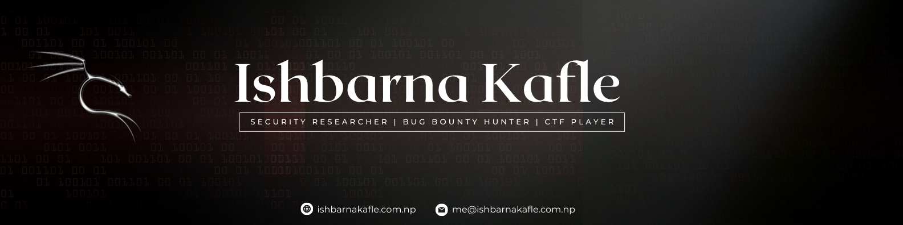

# 

---

## Introduction

I’m **Ishbarna Kafle**, a **Security Researcher** focusing on **Web Application Security and VAPT**. I actively participate in **CTFs, bug bounties, and hands-on security research**.  

Currently pursuing a **Bachelor’s in Computer Engineering**, I focus on understanding how systems break so they can be made more secure. I’m passionate about **learning, responsible disclosure, and making the digital world safer.**

---

## Recognized By

- **NASA** – Responsible Disclosure Recognition

---

## Tech & Tools

---

## Connect

        

---

⭐ *Exploring vulnerabilities and strengthening security.*
